<div align="center">


# Outlook-Auto

**Batch personalized email automation for Outlook — as a native desktop app.**

Upload an Excel sheet, pick a template, and Outlook-Auto renders every email,
saves it as a draft in your real Outlook drafts folder, and then batch-sends
them through the actual Outlook Web client — exactly as if you had written and
clicked "Send" yourself.

[](LICENSE)
[](https://github.com/jennifertang126/outlook-Auto/actions/workflows/ci.yml)
[](https://github.com/jennifertang126/outlook-Auto/actions/workflows/release.yml)
[](https://www.electronjs.org/)
[](https://react.dev/)
[](https://www.typescriptlang.org/)

[English](README.md) | [简体中文](README.zh-CN.md)

</div>

---

## ✨ Features

- **Microsoft account login with zero Azure setup** — no app registration, no admin consent, no client secret. Sign in with your normal Microsoft account in an embedded browser window.
- **Excel-driven recipients** — upload `.xlsx`/`.xls`, any columns become template placeholders.
- **`{{placeholder}}` templates** with a built-in rich text editor (bold / italic / underline, ⌘B/⌘I/⌘U), auto-detecting text vs HTML.
- **Recipient deduplication** — automatically checks your *Sent Items* via IMAP and marks/excludes people you have already emailed before.
- **Real drafts in your real mailbox** — emails are APPENDed to the Outlook drafts folder over IMAP with OAuth2, attachments included, so they sync to every device.
- **Human-like batch sending** — a visible browser window opens Outlook Web, walks through each draft and clicks *Send*. Multi-language button matching (English / 中文 / Deutsch / Français / Español), personal and enterprise accounts both supported.
- **Self-healing authentication** — access tokens auto-refresh; expired refresh tokens transparently trigger a re-login prompt instead of failing silently.
- **Connection diagnostics** — dashboard shows live Token / IMAP status and can auto-recover.
- **Full job history** — SQLite-backed jobs, per-recipient records, statuses, error messages, one-click delete.

## 🧠 The interesting parts

This project is a showcase of several less-common techniques glued into one product:

### 1. OAuth2 without an Azure app registration

Microsoft's identity platform accepts a handful of **public first-party client IDs**.
Outlook-Auto performs the standard authorization-code flow against
`login.microsoftonline.com` using one of them, requesting only IMAP/SMTP-scoped
delegation for *the signed-in user's own mailbox*. No secret is involved (public
client), so nothing needs to be configured or hidden:

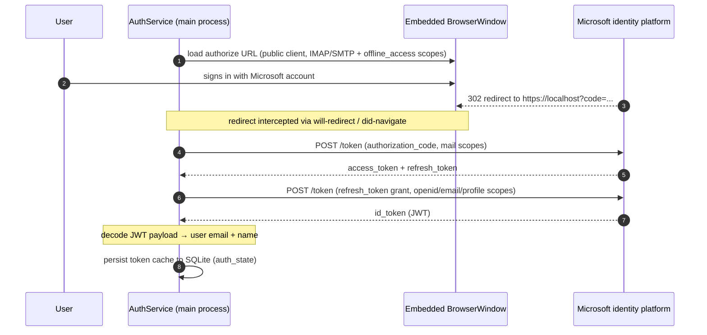

Tokens never leave the local SQLite database. Logout wipes both the token cache
and the browser session storage.

### 2. Drafts over IMAP `APPEND` (not Graph API)

Emails are composed as raw MIME (via nodemailer's `MailComposer`, attachments
inlined), then appended to the `Drafts` folder with the `\Draft \Seen` flags
using XOAUTH2 SASL auth. Because it's the standard IMAP path, drafts appear
instantly in Outlook Web / desktop / mobile and remain fully editable before
sending.

### 3. Sending via Outlook Web automation — on purpose

Outlook-Auto deliberately does **not** fire emails over SMTP. Instead it opens a
visible BrowserWindow on `outlook.office.com/mail/drafts` (or
`outlook.live.com` for personal accounts), locates each draft row, opens it,
clicks *Send*, and navigates back — all inside the real web client:

- messages leave through the exact same path as hand-sent mail (same headers,
  same sent-items behavior, no SMTP client fingerprint),
- the window title shows live progress (`Sending 3/12…`),
- if the web session expired, the window simply waits for the user to sign in
  (title shows which account to use), then continues.

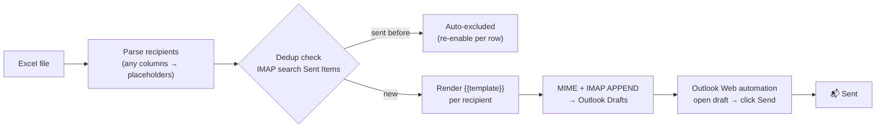

### 4. A job engine with retries and live progress

Draft creation runs in the background with exponential-backoff retries per
record; the renderer receives `job:progress` IPC events and renders live
progress bars. Sending maps results back **by index** (not by fragile subject
matching — that bug existed once, see v1.1.0 in the changelog).

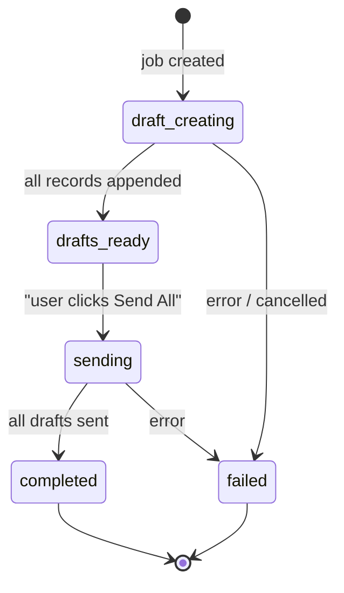

## 🏗️ Architecture

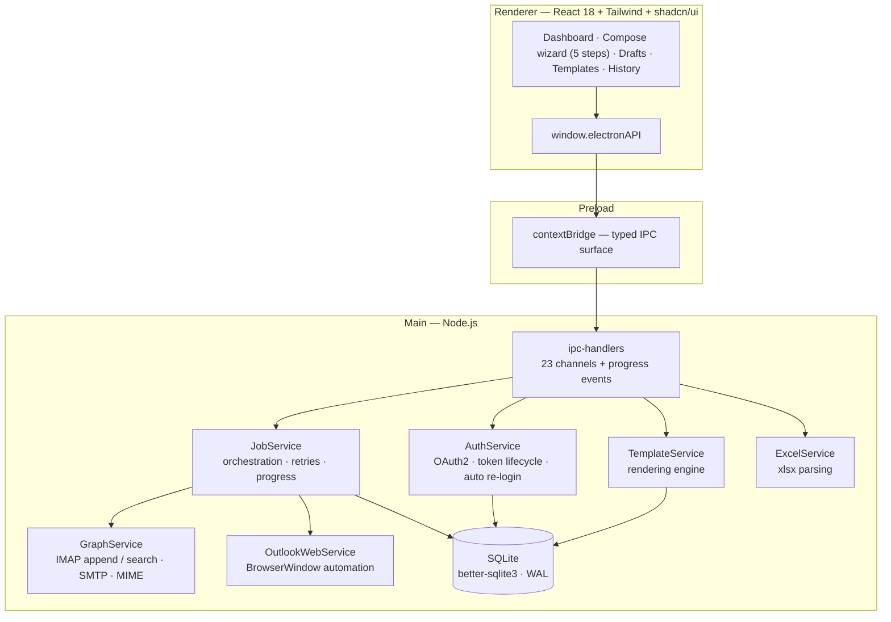

A deeper write-up — IPC surface, database schema, token self-healing, the
automation heuristics (how the *Send* button is found, SPA navigation, i18n
matching) — lives in [docs/ARCHITECTURE.md](docs/ARCHITECTURE.md).

<details>
<summary><b>📊 Data model</b></summary>

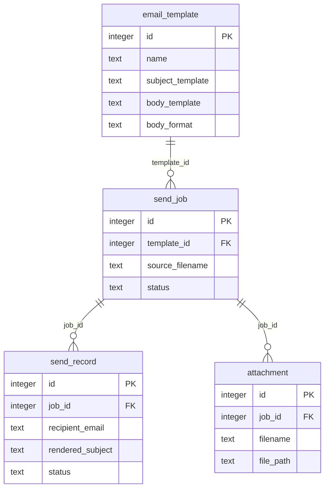

</details>

## 📸 Screenshots

<table>
  <tr>
    <td width="50%">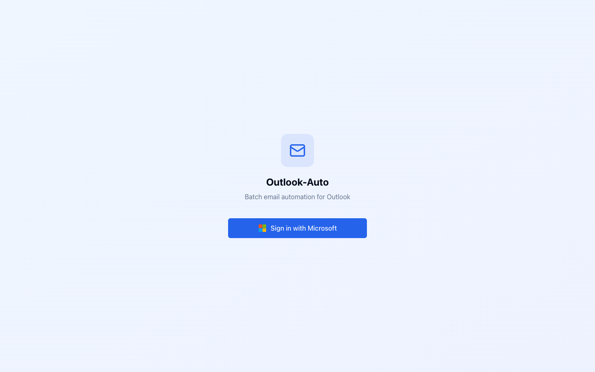</td>
    <td width="50%">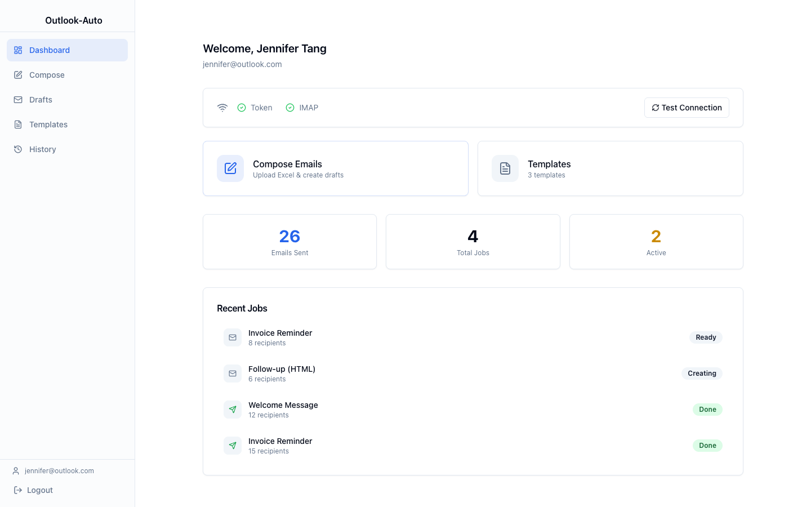</td>
  </tr>
  <tr>
    <td width="50%">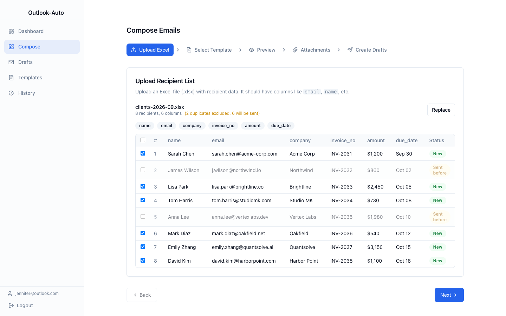</td>
    <td width="50%">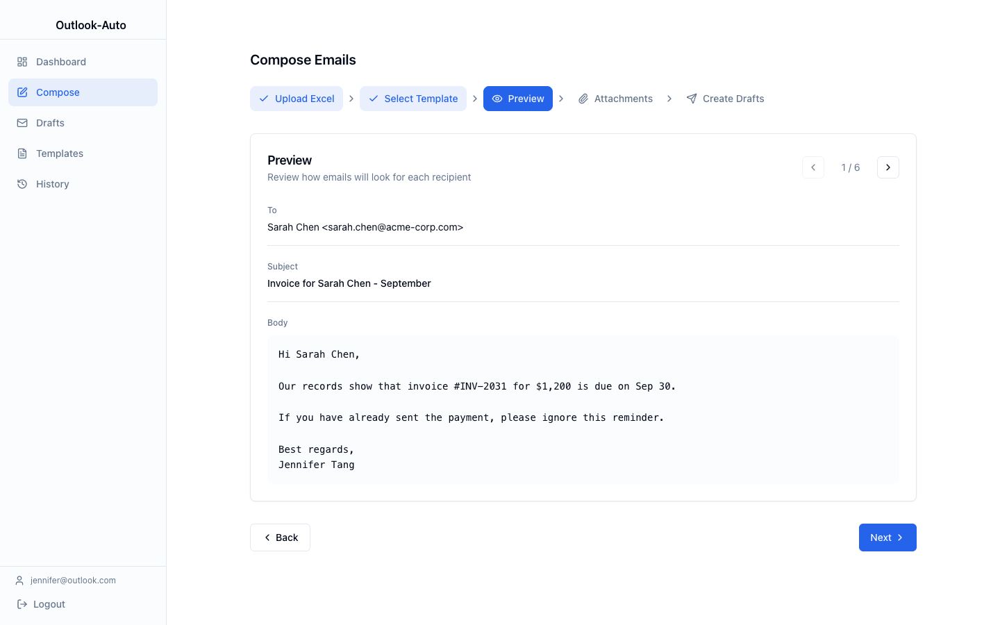</td>
  </tr>
  <tr>
    <td width="50%">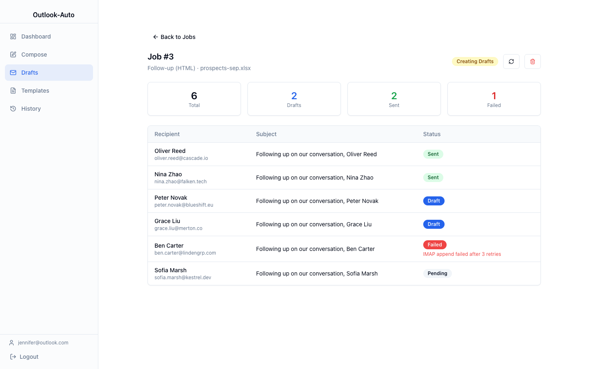</td>
    <td width="50%">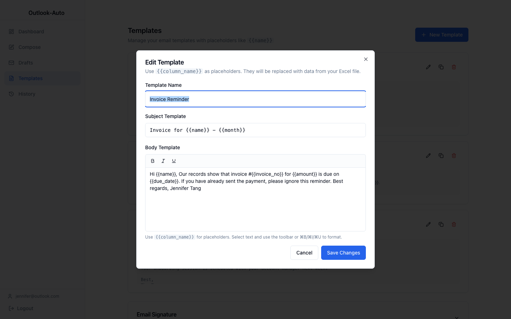</td>
  </tr>
</table>

Full walkthrough in [docs/screenshots](docs/screenshots/) — every step of the
Compose wizard (Upload → Template → Preview → Attachments → Confirm), the
Drafts list, Templates and History pages.

## 🚀 Getting started

### Prerequisites

- Node.js ≥ 20 and npm
- A Microsoft account with an Outlook mailbox (personal or enterprise)
- macOS for packaging (the `dmg` target builds arm64); `npm run dev` works on
  any desktop platform Electron supports

### Run in development

```bash
git clone https://github.com/jennifertang126/outlook-Auto.git
cd outlook-Auto
npm install
npm run dev
```

Sign in with your Microsoft account when the login window appears — that's the
whole setup.

### Build a release

```bash
npm run build:mac     # produces dist/outlook-auto-<version>-arm64.dmg
```

Or grab a prebuilt DMG from the [Releases](https://github.com/jennifertang126/outlook-Auto/releases)
page — every tag is built and published automatically by GitHub Actions.

## 📁 Project structure

```
src/
├── main/                      # Electron main process
│   ├── index.ts               # window lifecycle, app bootstrap
│   ├── ipc-handlers.ts        # 23 IPC channels + progress events
│   ├── database/              # SQLite schema, connection, migrations
│   └── services/
│       ├── auth.service.ts        # OAuth2 flow, token cache, self-healing
│       ├── graph.service.ts       # IMAP (drafts, dedup) + SMTP + MIME
│       ├── outlook-web.service.ts # Outlook Web automation (the sender)
│       ├── job.service.ts         # job orchestration, retries, progress
│       ├── template.service.ts    # {{placeholder}} rendering
│       └── excel.service.ts       # recipient import
├── preload/index.ts           # contextBridge — typed API surface
└── renderer/                  # React app
    ├── pages/                 # Login, Dashboard, Compose, Drafts, Templates, History
    ├── components/            # RichTextEditor, Layout, shadcn/ui primitives
    └── lib/                   # shared types, API client
```

## 🕰️ Version evolution

Twelve shipped versions in roughly a month, driven by real usage:

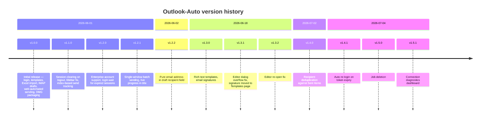

Full details in the [CHANGELOG](CHANGELOG.md).

## 🛠️ Tech stack

| Layer | Choice |
|---|---|
| Shell | Electron 33, electron-vite, electron-builder (arm64 DMG) |
| UI | React 18, TypeScript, Tailwind CSS, shadcn/ui (Radix), react-router |
| Mail | imapflow (IMAP XOAUTH2), nodemailer (MIME composer), SMTP OAuth2 |
| Data | better-sqlite3 (WAL), xlsx |
| CI/CD | GitHub Actions — build on every push, release DMG on every tag |

## ⚠️ Disclaimers

- **Unofficial project.** Not affiliated with, endorsed by, or sponsored by
  Microsoft. "Outlook" is a trademark of Microsoft Corporation.
- **Authentication** relies on a public first-party OAuth2 client ID (the same
  one Thunderbird uses) to avoid requiring every user to register an Azure
  app. Tokens are scoped to the signed-in user's own mailbox via IMAP/SMTP
  delegation and are stored only in the local SQLite database. This is a
  gray area under Microsoft's terms of service — use at your own risk.
- **Use responsibly.** Bulk email is subject to anti-spam law and your
  provider's policies. This tool is built for legitimate personalized
  communication with people you have a reason to email.
- The `xlsx` dependency is the last npm-published version (0.18.5); newer
  SheetJS releases are distributed outside npm.

## 📄 License

[MIT](LICENSE) © 2026 jennifertang126
