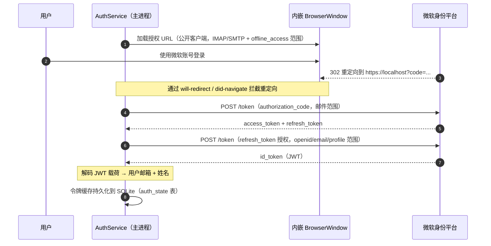
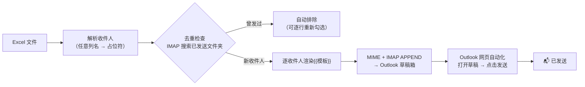
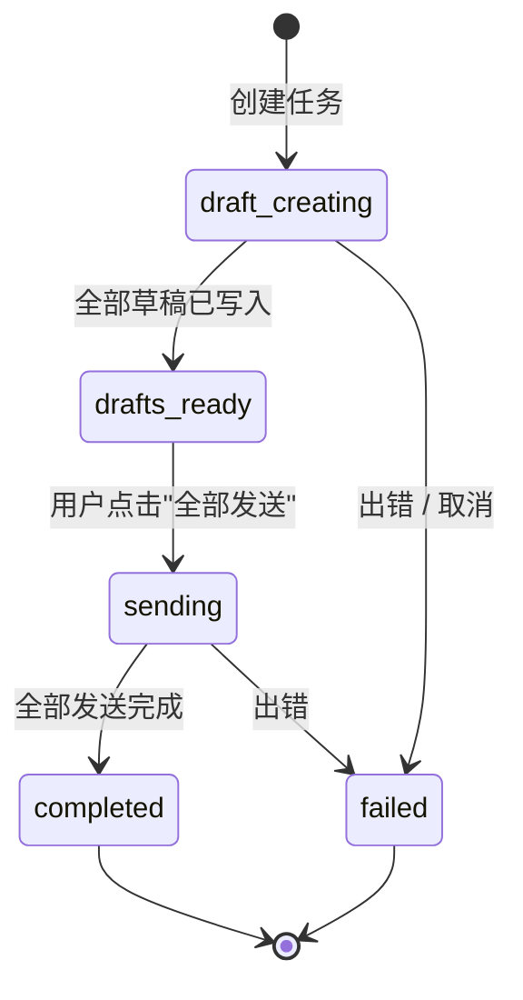
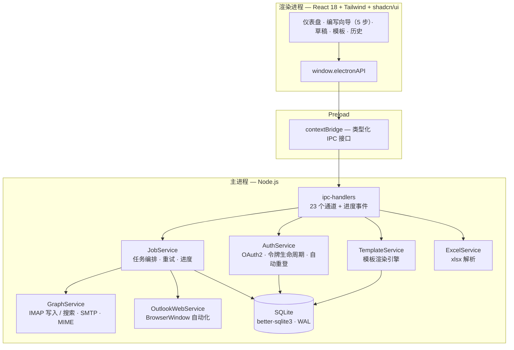
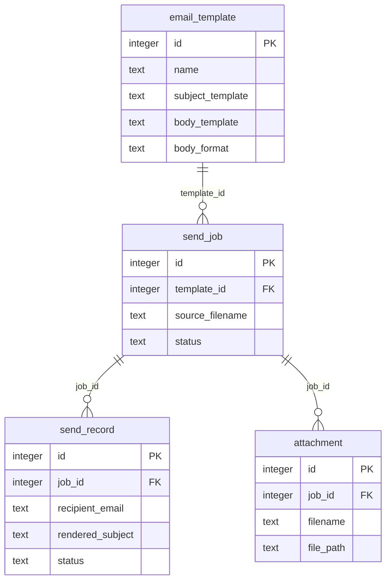
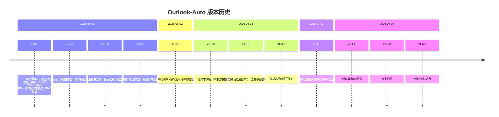

<div align="center">


# Outlook-Auto

**Outlook 批量个性化邮件自动化 —— 原生桌面应用。**

上传 Excel 收件人表，选择邮件模板，Outlook-Auto 会为每个收件人渲染邮件、
保存到你真实的 Outlook 草稿箱，然后通过真实的 Outlook 网页客户端批量发送 ——
效果和你亲手写好每一封、逐封点击"发送"完全一致。

[](LICENSE)
[](https://github.com/jennifertang126/outlook-Auto/actions/workflows/ci.yml)
[](https://github.com/jennifertang126/outlook-Auto/actions/workflows/release.yml)
[](https://www.electronjs.org/)
[](https://react.dev/)
[](https://www.typescriptlang.org/)

[English](README.md) | [简体中文](README.zh-CN.md)

</div>

---

## ✨ 功能特性

- **零 Azure 配置的微软账号登录** —— 无需应用注册、无需管理员同意、无需客户端密钥。在内嵌浏览器窗口中用普通微软账号登录即可。
- **Excel 驱动的收件人导入** —— 上传 `.xlsx`/`.xls`，任意列名自动成为模板占位符。
- **`{{占位符}}` 模板** —— 内置富文本编辑器（粗体/斜体/下划线，⌘B/⌘I/⌘U 快捷键），自动识别纯文本与 HTML 格式。
- **收件人去重** —— 通过 IMAP 自动检查"已发送邮件"文件夹，标记并默认排除曾经发过邮件的收件人。
- **草稿存进真实邮箱** —— 邮件以 OAuth2 方式通过 IMAP `APPEND` 到 Outlook 草稿文件夹（含附件），全设备实时同步。
- **拟人化批量发送** —— 打开可见的浏览器窗口操作 Outlook 网页版，逐封打开草稿并点击"发送"。多语言按钮匹配（English / 中文 / Deutsch / Français / Español），个人版与企业版账号均支持。
- **自愈式身份认证** —— 访问令牌自动刷新；刷新令牌过期时自动弹出重新登录，而不是静默失败。
- **连接诊断** —— 仪表盘实时显示 Token / IMAP 连接状态，并可自动恢复。
- **完整任务历史** —— 基于 SQLite 的任务、逐收件人记录、状态、错误信息，一键删除。

## 🧠 技术亮点

这个项目把若干不那么常见的工程技巧整合成了一个完整产品：

### 1. 无需 Azure 应用注册的 OAuth2

微软身份平台接受少量**公开的第一方客户端 ID**。Outlook-Auto 使用其中之一，
对 `login.microsoftonline.com` 走标准授权码流程，只为**登录用户自己的邮箱**
申请 IMAP/SMTP 范围的委托。公开客户端不涉及任何密钥，因此无需任何配置或隐藏：



令牌只保存在本地 SQLite 数据库中，绝不外传。登出时会同时清除令牌缓存与浏览器会话数据。

### 2. 通过 IMAP `APPEND` 建草稿（而非 Graph API）

邮件以原始 MIME 格式组装（借助 nodemailer 的 `MailComposer`，附件内联），
然后使用 XOAUTH2 SASL 认证追加到 `Drafts` 文件夹并打上 `\Draft \Seen` 标记。
因为走的是标准 IMAP 通道，草稿会即时出现在 Outlook 网页版/桌面版/移动端，
发送前可任意编辑。

### 3. 有意为之：通过 Outlook 网页自动化发送

Outlook-Auto 刻意**不**通过 SMTP 直发邮件，而是打开一个可见的
BrowserWindow 访问 `outlook.office.com/mail/drafts`（个人账号为
`outlook.live.com`），定位每条草稿、打开、点击*发送*、返回列表 —— 全部在
真实网页客户端内完成：

- 邮件走的路径与手工发送完全一致（相同的邮件头、相同的已发送行为，无 SMTP 客户端指纹）；
- 窗口标题实时显示进度（`Sending 3/12…`）；
- 若网页会话过期，窗口会等待用户登录（标题提示应使用的账号），登录后自动继续。



### 4. 带重试与实时进度的任务引擎

草稿创建在后台执行，逐条记录指数退避重试；渲染进程通过 `job:progress`
IPC 事件接收实时进度条。发送结果**按下标**回写（而非脆弱的主题文本匹配
—— 这个 bug 曾经存在过，见 CHANGELOG 的 v1.1.0）。



## 🏗️ 架构



更深入的技术剖析 —— IPC 接口清单、数据库结构、令牌自愈机制、自动化
启发式策略（如何找到*发送*按钮、SPA 导航、多语言匹配）—— 见
[docs/ARCHITECTURE.md](docs/ARCHITECTURE.md)。

<details>
<summary><b>📊 数据模型</b></summary>



</details>

## 📸 截图

> 待补充 —— 可在此处添加编写向导、去重表格、草稿页面和 Outlook 网页
> 发送窗口的截图。（下方 DMG 开箱即用，欢迎自行体验。）

## 🚀 快速开始

### 前置条件

- Node.js ≥ 20 与 npm
- 带有 Outlook 邮箱的微软账号（个人版或企业版）
- 打包需要 macOS（`dmg` 目标构建 arm64）；`npm run dev` 可在 Electron
  支持的任意桌面平台运行

### 开发运行

```bash
git clone https://github.com/jennifertang126/outlook-Auto.git
cd outlook-Auto
npm install
npm run dev
```

登录窗口出现后用微软账号登录 —— 这就是全部的配置工作。

### 构建发布版

```bash
npm run build:mac     # 产出 dist/outlook-auto-<版本号>-arm64.dmg
```

也可以直接从 [Releases](https://github.com/jennifertang126/outlook-Auto/releases)
页面下载预构建的 DMG —— 每次打 tag 都会由 GitHub Actions 自动构建并发布。

## 📁 项目结构

```
src/
├── main/                      # Electron 主进程
│   ├── index.ts               # 窗口生命周期、应用引导
│   ├── ipc-handlers.ts        # 23 个 IPC 通道 + 进度事件
│   ├── database/              # SQLite 结构、连接、迁移
│   └── services/
│       ├── auth.service.ts        # OAuth2 流程、令牌缓存、自愈
│       ├── graph.service.ts       # IMAP（草稿、去重）+ SMTP + MIME
│       ├── outlook-web.service.ts # Outlook 网页自动化（发送器）
│       ├── job.service.ts         # 任务编排、重试、进度
│       ├── template.service.ts    # {{占位符}} 渲染
│       └── excel.service.ts       # 收件人导入
├── preload/index.ts           # contextBridge —— 类型化 API 接口
└── renderer/                  # React 应用
    ├── pages/                 # 登录、仪表盘、编写、草稿、模板、历史
    ├── components/            # RichTextEditor、Layout、shadcn/ui 基础组件
    └── lib/                   # 共享类型、API 客户端
```

## 🕰️ 版本演进

一个月内发布十二个版本，全部由真实使用驱动：



完整细节见 [CHANGELOG](CHANGELOG.md)。

## 🛠️ 技术栈

| 层 | 选型 |
|---|---|
| 外壳 | Electron 33、electron-vite、electron-builder（arm64 DMG） |
| 界面 | React 18、TypeScript、Tailwind CSS、shadcn/ui (Radix)、react-router |
| 邮件 | imapflow（IMAP XOAUTH2）、nodemailer（MIME 组装）、SMTP OAuth2 |
| 数据 | better-sqlite3（WAL）、xlsx |
| CI/CD | GitHub Actions —— 每次推送构建、每次打 tag 发布 DMG |

## ⚠️ 免责声明

- **非官方项目。** 与 Microsoft 无关联、未被其认可或赞助。"Outlook" 是
  Microsoft Corporation 的商标。
- **身份认证**依赖一个公开的第一方 OAuth2 客户端 ID（Thunderbird 所使用的
  同一个），以避免要求每个用户注册 Azure 应用。令牌范围仅限登录用户自己的
  邮箱（IMAP/SMTP 委托），且只保存在本地 SQLite 数据库中。这在微软服务条款
  下属于灰色地带 —— 请自行评估风险。
- **负责任地使用。** 批量邮件受反垃圾邮件法律与服务商政策约束。本工具面向
  有正当理由进行的个性化沟通。
- `xlsx` 依赖为 npm 上发布的最后一个版本（0.18.5）；SheetJS 更新的版本在
  npm 之外分发。

## 📄 许可证

[MIT](LICENSE) © 2026 jennifertang126
