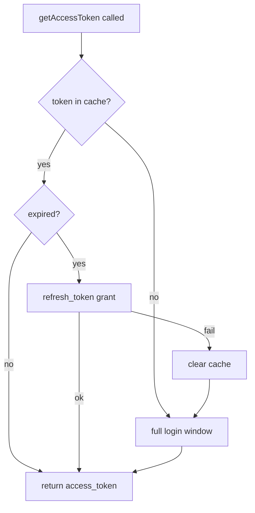
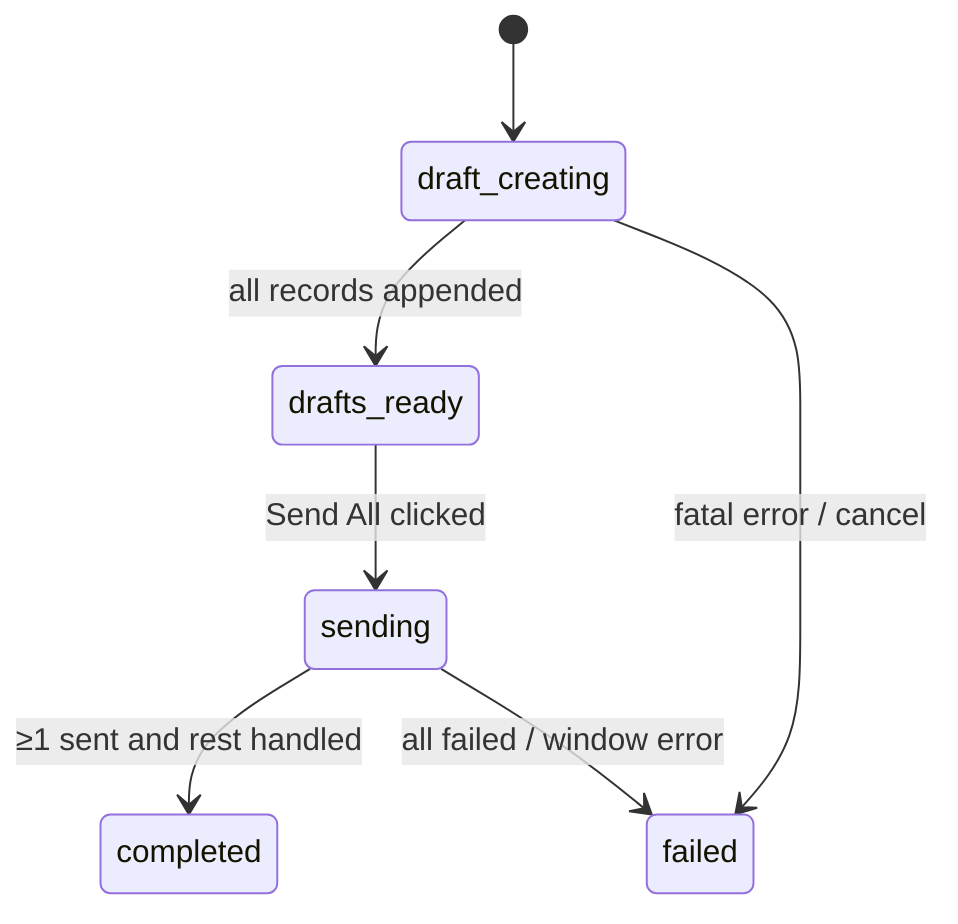

# Architecture Deep Dive

This document explains how Outlook-Auto works under the hood: the process
model, the authentication strategy, the draft pipeline, the Outlook Web
automation heuristics, and the job engine. It assumes you have read the
[README](../README.md) overview first.

> Naming note: `GraphService` was originally going to wrap the Microsoft Graph
> API. The implementation moved to IMAP/SMTP during development, but the class
> name stuck. It speaks IMAP and SMTP — no Graph calls are made anywhere.

## Table of contents

- [Process model](#process-model)
- [IPC surface](#ipc-surface)
- [Authentication](#authentication)
  - [Why no Azure app registration](#why-no-azure-app-registration)
  - [The login window](#the-login-window)
  - [Dual-resource token exchange](#dual-resource-token-exchange)
  - [Token persistence and self-healing](#token-persistence-and-self-healing)
- [The draft pipeline](#the-draft-pipeline)
- [Recipient deduplication](#recipient-deduplication)
- [Outlook Web automation](#outlook-web-automation)
  - [Account-type detection](#account-type-detection)
  - [Waiting for the mail UI (or login)](#waiting-for-the-mail-ui-or-login)
  - [Finding and opening a draft](#finding-and-opening-a-draft)
  - [Clicking Send, in any language](#clicking-send-in-any-language)
  - [Navigating back without a reload](#navigating-back-without-a-reload)
- [Job engine](#job-engine)
- [Database schema](#database-schema)
- [Renderer design](#renderer-design)
- [Build and packaging](#build-and-packaging)
- [Known limitations](#known-limitations)

## Process model

Standard three-part Electron split, with a strict "renderer never touches Node"
policy:

| Process | Responsibilities |
|---|---|
| **Main** (`src/main`) | Window lifecycle, all mail/IO work, SQLite, OAuth2, the Outlook Web automation windows |
| **Preload** (`src/preload`) | `contextBridge` exposing a small, typed `window.electronAPI` |
| **Renderer** (`src/renderer`) | Pure React UI; communicates only through the bridge |

Every BrowserWindow is created with `nodeIntegration: false` and
`contextIsolation: true` (Electron defaults are kept on purpose). The login
window and the Outlook Web send window are plain web views with no preload
script at all.

## IPC surface

All IPC is `ipcMain.handle` request/response plus one push event:

| Channel | Purpose |
|---|---|
| `auth:getStatus` | Cached session info (no network if token valid) |
| `auth:login` | Run the full interactive login flow |
| `auth:logout` | Clear token cache **and** browser session storage |
| `auth:refreshToken` | Diagnostic: force a token refresh |
| `auth:testConnection` | Diagnostic: refresh token + lightweight IMAP probe |
| `templates:list/create/update/delete/preview` | Template CRUD + render preview |
| `recipients:openFileDialog` | Native file picker for Excel |
| `recipients:parseExcel` | Parse first sheet → `{columns, rows}` |
| `recipients:checkSent` | Dedup check against Sent Items (v1.4.0+) |
| `jobs:create/list/getDetail` | Job lifecycle |
| `jobs:sendAll/sendOne` | Trigger Outlook Web sending |
| `jobs:cancel/delete` | Cancel / remove a job and its records (delete: v1.5.0+) |
| `attachments:openFileDialog` | Multi-select file picker |
| `settings:get/set` | Simple key-value store (signature, last login email) |
| **push** `job:progress` | `{jobId, current, total, phase, status, error}` broadcast to all windows |

## Authentication

### Why no Azure app registration

The normal path for a Microsoft mail app is: register an Azure application,
obtain a client ID (+ secret or redirect config), request admin consent for
`Mail.ReadWrite`-style Graph scopes, and live with the consent screens. For a
personal productivity tool that only ever touches *the signed-in user's own
mailbox*, that ceremony is disproportionate.

Microsoft's identity platform also accepts several **public first-party client
IDs** — identifiers of Microsoft's own applications (and Thunderbird's) that are
designed to be embedded in distributed binaries. Outlook-Auto uses Thunderbird's
client ID with IMAP/SMTP scopes:

```
https://outlook.office.com/IMAP.AccessAsUser.All
https://outlook.office.com/SMTP.Send
offline_access
```

No secret exists (public client), the redirect URI is `https://localhost`, and
the user consents to exactly one thing: letting this app access *their own*
mailbox the way Thunderbird does.

### The login window

`AuthService.openLoginWindow()` builds the authorize URL and loads it in a
small frameless `BrowserWindow`. Four navigation events are hooked
(`will-redirect`, `will-navigate`, `did-navigate`, `did-fail-load`) so the
`https://localhost?code=...` redirect is caught no matter how the identity
platform chooses to deliver it:

```ts
win.webContents.on('will-redirect', (e, u) => { if (handle(u)) e.preventDefault() })
```

Interception matters: `https://localhost` isn't listening, so without
`preventDefault()` the window would show a connection-error page. A `settled`
flag guarantees the promise resolves exactly once, and closing the window
rejects with a clean "Login window was closed" error (which the UI deliberately
shows without a toast — the user simply changed their mind).

### Dual-resource token exchange

One subtlety: a single OAuth grant cannot mix the IMAP resource and the
identity (`openid`/`email`/`profile`) scopes in one token. So after the mail
token comes back, a second refresh-token grant fetches the identity token:

```ts
// 1) mail access
await tokenRequest({ grant_type: 'authorization_code', code, ... })
// 2) who is this? (separate resource)
await tokenRequest({ grant_type: 'refresh_token', refresh_token, scope: IDENTITY_SCOPES })
```

The email/name are then decoded locally from the JWT payload (base64url →
JSON, no signature verification — this is display metadata, not authorization).

### Token persistence and self-healing

The whole token cache (access + refresh + expiry + identity) is one JSON blob
in the `auth_state` table. The lifecycle is a small state machine:



The important design decision (shipped in v1.4.1): **failure of any background
token path triggers an interactive re-login instead of an error**. Before
v1.4.1, coming back to the app after a few weeks produced mysterious
"Dedup check failed" errors; now the Microsoft login window simply appears at
the moment the token is needed, and the operation retries against the fresh
token. `getStatus()` is deliberately the exception — it reports
`authenticated: false` without popping windows, so merely opening the app never
surprises you with a login dialog.

## The draft pipeline

When a job is created (`jobs:create`):

1. The template is rendered per recipient — `{{column}}` placeholders are
   replaced with that row's values (unknown keys are left intact rather than
   blanked, which makes missing-column mistakes visible in the preview).
2. If a signature is configured, it is appended (as HTML `<br>` or plain
   newlines, depending on the template's `body_format`).
3. Job + records + attachment metadata are inserted transactionally.
4. Draft creation runs **in the background** (the IPC call returns
   immediately); the renderer follows progress via `job:progress` events.

Per record, `GraphService.saveDraft()`:

- builds a MIME message with `MailComposer` (from/to/subject, body as text or
  HTML, attachments read into buffers with proper MIME types),
- connects to `outlook.office365.com:993` with **XOAUTH2**
  (`user` + the OAuth access token as SASL),
- `APPEND`s to the `Drafts` mailbox with `\Draft \Seen` flags.

Failures retry with exponential backoff (1s, 2s, 4s — three attempts); a
record that still fails is marked `failed` with the error message, and the job
continues.

Because this is plain IMAP, the drafts show up in Outlook Web/desktop/mobile
within seconds and are ordinary, editable drafts.

## Recipient deduplication

Right after an Excel upload (v1.4.0), the app opens one IMAP connection,
locates the sent folder via `SPECIAL-USE` (`\Sent` — reliable across locales,
unlike hardcoding "Sent Items"):

```ts
for (const folder of await client.list()) {
  if (folder.specialUse === '\\Sent') { sentFolder = folder.path; break }
}
```

then issues one `SEARCH TO <address>` per recipient. Hits become "Sent before"
badges and are auto-unchecked in the recipient table (individually
re-enableable; a select-all checkbox lives in the header). This turns the
classic "did I already reply to this person?" spreadsheet ritual into a
one-glance table.

## Outlook Web automation

The sending stage is the part that most often surprises people, so here is the
full reasoning and machinery.

**Why automate the web client instead of using SMTP?** The app already has an
`SMTP.Send`-scoped token and a working `sendEmail()` implementation. But
sending over SMTP means: mail leaves from a desktop MTA fingerprint, threading
can differ from what Outlook itself would produce, and deliverability for
bulk-ish personal mail benefits from going through the exact same pipeline as
hand-sent mail. Automating the real web client means every message is, as far
as Microsoft's servers are concerned, hand-sent — same headers, same sent
items, same everything. The tradeoff is fragility, which the heuristics below
manage.

`OutlookWebService.sendAllDrafts(subjects, userEmail, onProgress)` opens **one**
`BrowserWindow` (visible — the user can watch and intervene), loads the drafts
folder, and then loops: open draft → click Send → navigate back → next.

### Account-type detection

Personal accounts (`outlook.com`, `hotmail.com`, `live.com`, `msn.com`) live on
`outlook.live.com`, enterprise tenants on `outlook.office.com` — v1.2.0 made
this a simple domain check on the signed-in email.

### Waiting for the mail UI (or login)

The automation never assumes a ready page. It polls for up to three minutes:

- If the current URL is a login page (`login.microsoftonline.com`,
  `login.live.com`, …), the title switches to *"Please sign in with
  you@example.com"* and the loop keeps waiting — the user signs in by hand,
  no credentials are ever handled by the app.
- Otherwise a `mailReadyCheck()` probe runs in the page: any of
  `[data-convid]`, `[role="option"]`, `[role="listbox"]`,
  `[aria-label*="Message list"]`, or the localized 邮件列表 variant counts as
  "the mail UI is mounted".

### Finding and opening a draft

A `TreeWalker` walks every element collecting *direct* text nodes only (so a
row whose visible text includes the subject still yields an element whose own
text is exactly the subject):

1. **Exact match wins** — click the closest clickable ancestor
   (`[role="option"]`, `[role="listitem"]`, `[role="treeitem"]`,
   `[data-convid]`, `[tabindex]`).
2. Otherwise the **shortest containing text** is chosen as a fallback
   (substring match), preferring the most specific element.

Exact-first matching was the v1.1.0 fix for a real bug: when one subject is a
substring of another ("Invoice" vs "Invoice — March"), text containment alone
opened the wrong draft.

### Clicking Send, in any language

Once a draft is open, the page is polled for a Send button. Candidates are
`button`, `[role="button"]`, `[role="menuitem"]` elements whose text/aria-label
equals one of `Send / send / 发送 / 發送 / Senden / Envoyer / Eviar` — the
equality check (plus a child-count guard) avoids clicking a random paragraph
that merely contains the word.

### Navigating back without a reload

After a send, the app must return to the drafts list for the next message. A
full `loadURL` would re-bootstrap the whole SPA (slow, and occasionally dropped
the session). Instead the sidebar link is clicked in-page: first
`a[href*="draft" i]` whose href looks like a mail route; otherwise a
`[role="treeitem"]` whose text (digits stripped) matches the localized folder
name (`Drafts / 草稿 / 草稿箱 / Brouillons / Entwürfe / Borradores`). The
mail-ready probe then confirms the list is interactive again.

Results are reported **by array index**, which is why `sendAllDrafts` takes
the subject list and returns `{index, success, error}` per entry — the mapping
back to `send_record` rows is exact, never text-based.

## Job engine

`JobService` owns the lifecycle:



- Record-level statuses: `pending → draft_created → sent | failed`.
- Draft creation: sequential with 1.5s spacing between IMAP appends
  (be gentle to the server), per-record retry with backoff.
- Sending: `OutlookWebService` drives one window for the whole batch;
  per-record outcomes update by index.
- `cancel()` flips outstanding records to `failed: 'Cancelled'`.
- `deleteJob()` removes attachments, records, and the job row.
- Progress is broadcast to every window via `webContents.send`; the renderer
  subscribes through the preload's `onJobProgress` (returning an unlisten
  function, hook-style).

## Database schema

Six tables in one SQLite file (WAL mode, foreign keys enforced), stored under
`app.getPath('userData')/data/`:

- `email_template` — name, subject/body templates, `body_format`
  (`text` | `html`).
- `send_job` — one per compose submission; `status` + counts.
- `send_record` — one per recipient: rendered subject/body, recipient data
  (JSON), draft UID, status, error message.
- `attachment` — files attached to a job (original paths + MIME + size;
  content is streamed into each draft at append time).
- `auth_state` — single-row token cache blob.
- `settings` — key/value (email signature, last login email).

`migrations.ts` is an intentional no-op placeholder for future schema changes.

## Renderer design

- `HashRouter` (file://-safe), auth-gated at the root: unauthenticated users
  only ever see `LoginPage`.
- `ComposePage` is a five-step wizard (Upload → Template → Preview →
  Attachments → Confirm) with forward gating and click-to-jump-back.
- The rich text editor is a ~140-line `contentEditable` component: toolbar +
  ⌘B/I/U via `document.execCommand`, clean-paste (prefers `text/html`, falls
  back to `text/plain`), and a `valueRef` that distinguishes external value
  changes from its own input events (the v1.3.2 fix for "editor shows empty
  body when re-opening a template").
- The compose table renders per-row checkboxes with "Sent before" / "New"
  badges; excluded rows dim and are filtered out of preview navigation,
  counts, and submission.

## Build and packaging

- `electron-vite` builds main/preload/renderer separately; `better-sqlite3`
  is externalized and rebuilt against Electron headers via
  `electron-builder install-app-deps` (postinstall).
- `electron-builder` packages a macOS arm64 DMG (unsigned — `identity: null`,
  `notarize: false`; see [limitations](#known-limitations)).
- CI (GitHub Actions): every push builds on ubuntu + macos; every `v*` tag
  builds the DMG on a macos-14 (arm64) runner and publishes a GitHub Release.

## Known limitations

- **Unsigned binaries** — macOS Gatekeeper will require a right-click → Open
  (or `xattr -d com.apple.quarantine`) on first launch. Code signing requires
  an Apple Developer ID, which is out of scope for a personal OSS project.
- **Send automation is heuristic** — Outlook Web's DOM is not a contract.
  The selectors used here were stable across 2026 usage, but a major OWA
  redesign could break them (the failure mode is a per-record error message,
  not silent corruption — drafts stay in the mailbox).
- **tsc is not clean** — the codebase builds via esbuild (electron-vite),
  which does not typecheck; a handful of narrowing-related `tsc` errors exist
  in the current tree. They don't affect the built app.
- **Excel parsing** takes the first sheet, and the `xlsx` dependency is frozen
  at the last npm-published 0.18.5.
- **macOS-first** — the DMG target is arm64-only; nothing is Windows/Linux
  *broken* by design, but it's untested there.
